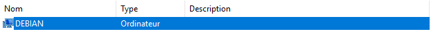
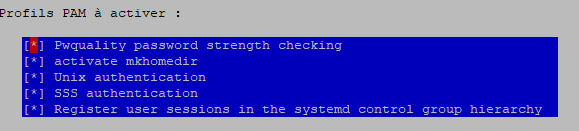

# Lié debian 11 à l'active directory

## Prérequis
- Active directory : :+1:
- Debian 11 : :+1:

## Installation des libs
``` 
apt -y install realmd sssd sssd-tools libnss-sss libpam-sss adcli samba-common-bin oddjob oddjob-mkhomedir packagekit 
```

## Configuration du DNS
Editer le fichier de configuration dns
``` 
vim /etc/resolv.conf 
```

Entrer votre configuration
``` 
domain fr.kavi.ad
search fr.kavi.ad
nameserver 192.168.56.112
```

### Realm configuration
Découvrir l'AD
```
realm discover fr.kavi.ad 
```

Joindre l'AD **(FR=Administrateur,EN=Administrator)**
```
realm join --user=Administrateur fr.kavi.ad
```

Votre debian devrait avoir rejoint l'ad



Vous pouvez aussi verifier à l'aide de la commande id 
```
id villakl@fr.kavi.ad
```

Permettre de créer automatiquement le dossier de l’utilisateur /home/"user" ***(Executer dans votre shell)***
```
bash -c "cat > /usr/share/pam-configs/mkhomedir" <<EOF
Name: activate mkhomedir
Default: yes
Priority: 900
Session-Type: Additional
Session:
        required                        pam_mkhomedir.so umask=0022 skel=/etc/skel
EOF
```

```
pam-auth-update
```



```
systemctl restart sssd
```

Permettre à un utilisateur de se connecter
```
realm permit villakl@coud.local
```

Autoriser l’accès à un groupe d’utilisateurs du domaine
```
sudo realm permit -g groupName
```

Ajouter plusieurs groupes d’utilisateurs
```
sudo realm permit 'Domain Users' 'admin users'
```
Autoriser la connexion de tous les utilisateurs du domaine (non recommandé) :
```
sudo realm permit --all
```
Desactiver la connexion de tous les utilisateurs :
```
sudo realm  deny --all
```


Configurer l’authentification avancé pour octroyer des droits sudo à un utilisateur membre du domaine

Nous devons créer le fichier suivant :

sudo nano /etc/sudoers.d/domain_admins
```
villakl@fr.kavi.ad        ALL=(ALL)       ALL
```
Rappel : Pour promouvoir un simple utilisateur. (Autoriser d’abord la connexion « Normal » avec : realm permit nestor@coud.local)

Promouvoir un groupe entier d’utilisateur.
```
%groupName@example.com     ALL=(ALL)   ALL
```
Rappel : pour promouvoir (Autoriser d’abord la connexion « Normal » avec : sudo realm permit -g groupName)
Connexion SSH

```
ssh COUD\\world@localhost
# connexion ssh depuis le serveur ubuntu vers le serveur ubuntu en guise de test:) 
# Coud = Netbios du domaine 
# world = un utilisateur AD qui a été autorisé à se connecter en amont 
```
Attention, si vous utilisez putty, depuis un ordinateur distant, mettez simplement un seul antislash \

Enfin, pour terminer, nous pouvons constater que dans la console Active directory users and computers votre objet ordinateur est bel est bien présent.
